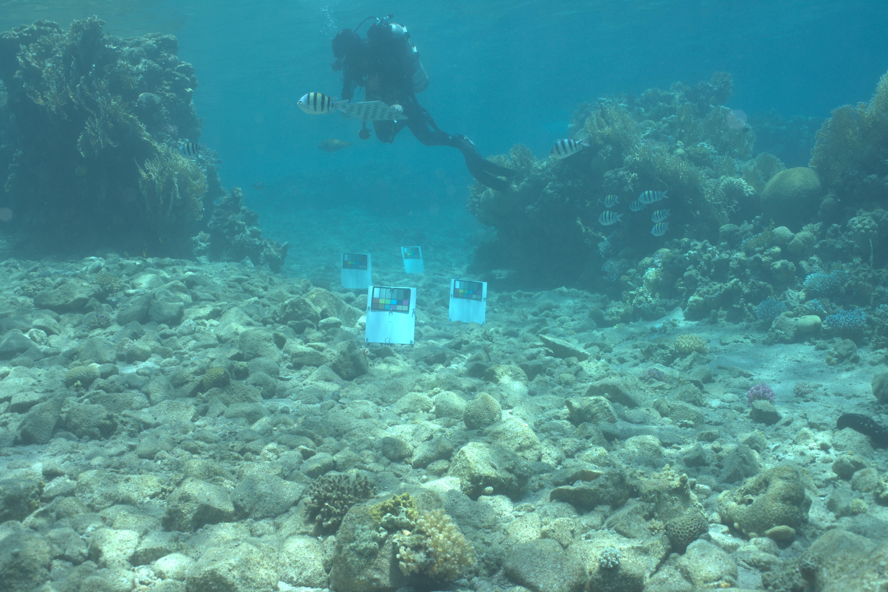

# Underwater Image Color Correction using the Sea-thru model
We present our take on Sea-thru ( http://csms.haifa.ac.il/profiles/tTreibitz/webfiles/sea-thru_cvpr2019.pdf ), a method for color correction of underwater images, including a new approach for the physical model’s coefficients estimation and its practical implementation. Using a single or multiple underwater images and their depth maps we output a physically corrected image.

## Image formation model
The formation model discussed in the 2019 paper, treats each pixel as a sum of two physical phenomena.

The first is the attenuated light reflected from an object, and is absorbed or scattered away by the medium (water) on its way to the camera (denoted by AL, Attenuated Light). The second is light arriving from other objects in the area that is scattered by the medium towards the camera (denoted by BS, Backscatter). The formation model is shown  with a subscript $c$ which represents one of the RGB color channels. The AL term decays exponentially over distance $z$, at a rate defined by $\beta_c^D$ from its initial (“real”/open-air) intensity $J_c^D$ and the BS is a growing term at a rate defined by $\beta_c^B$ until it saturates at $B_c^{\infty}$ . These coefficients and their physical justification are broadly discussed in the 2019 paper.

## Optimization Problem
We designed the following Lagrangian $\mathcal{L}_{c}(v_{c},z)$ which we minimize in our optimization problem:

$$I_c(z) = \underbrace{J_{c}^{D}\cdot e^{-\beta_{c}^{D}\cdot z}}_{AL_{c}}+\underbrace{B_{c}^{\infty}\left(1-e^{-\beta_{c}^{B}\cdot z}\right)}_{BS_{c}}$$

$$
\begin{aligned}
\mathcal{L}_{c}(v_{c},z)= &\underbrace{\eta(I_{c}^{lp}-BS_{c})^{2}}_{\text{Backscatter/lower percentile vector reconstruction loss}} \cr
+& \underbrace{\mu\left[max\left(0,BS_{c}-I_{c}^{lp}\right)\right]^{2}}_{\text{BS upper barrier function}} \cr
+& \underbrace{\sum_{_{i\in\{lp,hp,mean\}}}\left[(I_{c}^{(i)}-BS_{c})-AL_{c}^{(i)}\right]^{2}}_{\text{AL Intensity vectors reconstruction loss}} \cr
+&\underbrace{\lambda^{(i)}\left[max\left(0,\left(I_{c}^{(i)}-BS_{c}\right)-AL_{c}^{(i)}\right)\right]^{2}}_{\text{AL Lower barrier function}}\\
+&\underbrace{\gamma\left[var(I_{c})-\sigma_{cD}^{2}e^{-2\frac{a}{\sqrt{b+z}}\cdot z}-\sigma_{cB}^{2}e^{-2\beta_{c}^{B}\cdot z}\right]^{2}}_{\text{Intensity color variance loss}}
\end{aligned}
$$
